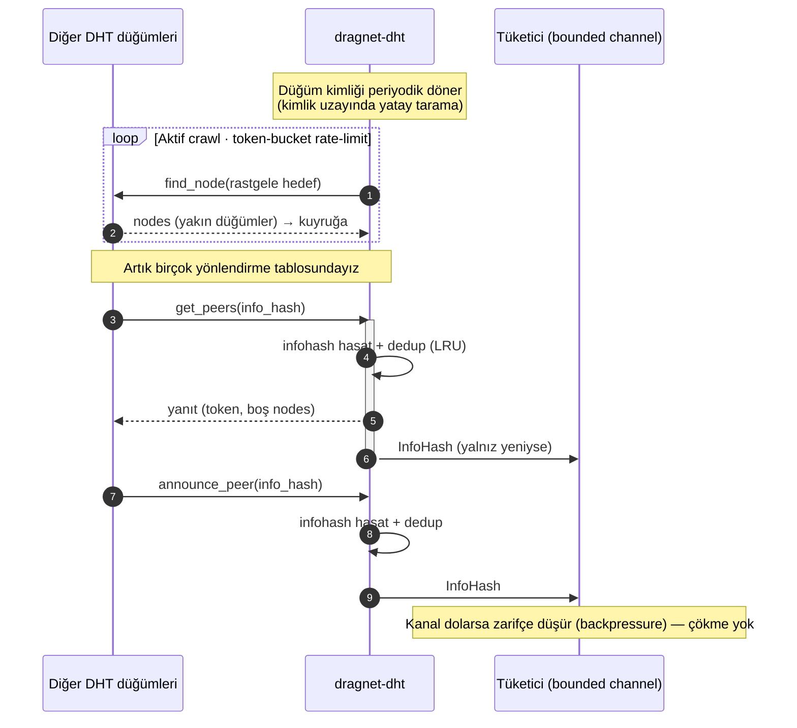
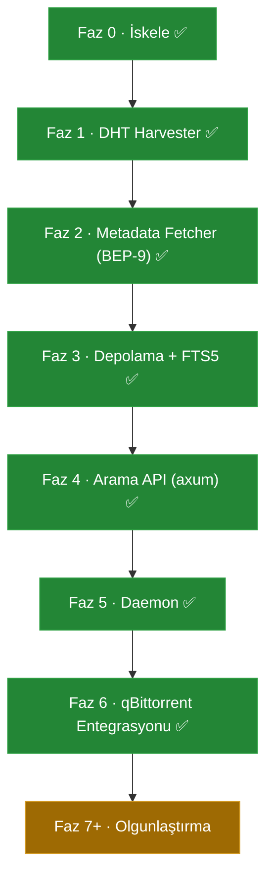

<!-- SPDX-License-Identifier: AGPL-3.0-only -->
<div align="center">

# 🛰️ Dragnet

**Otonom BitTorrent DHT keşif ve indeksleme motoru — Rust ile.**

*Autonomous BitTorrent DHT discovery & indexing engine. No websites. No trackers. The network is the source of truth.*

[](LICENSE)
[](COMMERCIAL-LICENSE.md)
[](https://www.rust-lang.org)
[](https://tokio.rs)
[](docs/ROADMAP.md)

</div>

---

## Dragnet nedir?

Dragnet, hiçbir web sitesine veya tracker'a bağımlı olmadan **BitTorrent DHT ağını
doğrudan tarayarak** infohash'leri ve torrent metadata'sını (isim, dosya listesi,
boyut) hasat eder, bunları aranabilir bir tam-metin indeksine dönüştürür ve bir
**HTTP arama API'si** üzerinden sunar. qBittorrent'e ince bir `nova3` plugin'i ile bağlanır.

## Neden var? — Çözdüğü problem

qBittorrent'in mevcut arama motoru (`nova3`, Python) bir **meta-arama scraper'ıdır**:
başka torrent sitelerinin arama sayfalarını çeker ve HTML ayrıştırır. O siteler
kapandığında arama **kör olur**.

Dragnet farklı bir yerden beslenir — **ağın kendisinden**:

| | Site-scraper (nova3) | Dragnet |
|---|---|---|
| Veri kaynağı | 3. parti torrent siteleri | BitTorrent DHT ağı (BEP-5) |
| Siteler çökerse | Arama durur | Çalışmaya devam eder |
| Veritabanı silinirse | Kalıcı kayıp | Ağı yeniden tarayıp indeksi sıfırdan kurar |
| Bağımlılık | HTML yapısına kırılgan bağımlılık | Yok — protokol standartları (BEP-5/9/10) |

> **İlke:** İndeks, ağdan yeniden üretilebilir bir önbellektir; asla "kaybedilemez"
> tek gerçeklik değildir. **Ağ = tek gerçeklik kaynağı.**

Emsal: [magnetico](https://github.com/boramalper/magnetico) (Go, AGPLv3). Dragnet, aynı
fikri Rust/tokio ekosisteminde ve qBittorrent entegrasyonuna odaklı olarak yeniden kurar.

## Mimari ve veri akışı

```mermaid
flowchart LR
    NET([BitTorrent DHT Ağı]):::net
    NET -->|"BEP-5<br/>get_peers · announce_peer"| DHT

    subgraph DRAGNET["Dragnet servisi · Rust / tokio"]
        direction LR
        DHT["<b>dragnet-dht</b><br/>DHT harvester<br/>Faz 1 ✅"]:::done
        META["<b>dragnet-meta</b><br/>metadata fetcher<br/>BEP-9 · Faz 2 ✅"]:::done
        STORE["<b>dragnet-store</b><br/>SQLite + FTS5<br/>Faz 3 ✅"]:::done
        API["<b>dragnet-api</b><br/>HTTP arama API<br/>axum · Faz 4 ✅"]:::done
        DHT -->|"benzersiz infohash<br/>(bounded channel)"| META
        META -->|"TorrentRecord"| STORE
        STORE --> API
    end

    API -->|"GET /search → JSON"| PLUG["qBittorrent<br/>nova3 plugin<br/>Faz 6 ✅"]:::done
    PLUG --> USER([Kullanıcı])

    classDef net fill:#1f6feb,stroke:#1f6feb,color:#fff;
    classDef done fill:#238636,stroke:#2ea043,color:#fff;
    classDef todo fill:#30363d,stroke:#8b949e,color:#c9d1d9,stroke-dasharray:4 3;
```



Bileşenler bağımsız crate'lerdir; her biri ayrı ölçeklenir ve ayrı test edilir.
Ayrıntı: [`docs/ARCHITECTURE.md`](docs/ARCHITECTURE.md).

## Pasif hasat nasıl çalışır? (Faz 1 — `dragnet-dht`)

DHT'de pasif dinleme tek başına yeterince trafik görmez; ağın **bizi tanıması**
gerekir. Bu yüzden `dragnet-dht`, magnetico'nun "indexing service" yaklaşımını izler:
aktif olarak rastgele hedeflere `find_node` göndererek birçok düğümün yönlendirme
tablosuna girer, sonra bu düğümlerin bize yönelttiği `get_peers` / `announce_peer`
sorgularından infohash hasat eder.



**Tasarım kararı (spike):** Aday crate'lerden `mainline` (v8) bakımlı ama gelen
sorgunun `info_hash`'ini dışa açmıyor (`RequestFilter` yalnız `bool` döndürüyor);
`rustydht-lib` ise artık yayınlanmıyor. Bu yüzden `mainline`'ı **temel** olarak
(BEP-42 uyumlu düğüm kimliği, bootstrap listesi) kullanıp pasif dinleme için
`tokio::net::UdpSocket` üzerinde **kendi ince KRPC katmanımızı** yazdık. Tam gerekçe:
[`docs/ARCHITECTURE.md` §7.1](docs/ARCHITECTURE.md).

## Yol haritası



Fazlı planın tamamı ve "Definition of Done" ölçütleri: [`docs/ROADMAP.md`](docs/ROADMAP.md).

## Hızlı başlangıç

Gereksinim: Rust 1.85+ (`rustup`).

```bash
# Derle ve test et
cargo build
cargo test

# Tüm servisi çalıştır: harvester + metadata fetcher + store + arama API tek süreçte
cargo run -p dragnetd
```

`dragnetd` çalışırken arama API'si `http://127.0.0.1:8080` adresinde sunulur:

```bash
curl "http://127.0.0.1:8080/healthz"                 # → ok
curl "http://127.0.0.1:8080/stats"                   # → {"fetched_torrents":N,"total_infohashes":M}
curl "http://127.0.0.1:8080/search?q=ubuntu&limit=5" # → {"results":[…]}
```

Yapılandırma için `dragnetd.example.toml` dosyasına bakın (DB yolu, bind adresi, token,
`seed_infohashes` ile indeks ısıtma). Ayrı bileşen demoları:

```bash
# Faz 1: DHT'den canlı infohash hasat et
cargo run -p dragnet-dht --example harvest

# Faz 2: bilinen bir infohash için metadata çek
cargo run -p dragnet-meta --example fetch -- 08ada5a7a6183aae1e09d831df6748d566095a10
```

> **İpucu:** Pasif hasat verimi, sabit ve **yönlendirilmiş (port-forward)** bir UDP
> portuyla belirgin artar (`HarvesterConfig.port`). NAT arkasında da çalışır ama
> gelen `get_peers` trafiği daha azdır.

## Depo yapısı

```
dragnet/
├─ crates/
│  ├─ dragnet-core/    # paylaşılan tipler (InfoHash, TorrentRecord)         ✅
│  ├─ dragnet-dht/     # DHT harvester (KRPC dinleyici + aktif crawl)        ✅ Faz 1
│  ├─ dragnet-meta/    # metadata fetcher (BEP-3/10/9 peer-wire)             ✅ Faz 2
│  ├─ dragnet-store/   # SQLite + FTS5 kalıcılık ve arama indeksi            ✅ Faz 3
│  └─ dragnet-api/     # axum HTTP arama API                                 ✅ Faz 4
├─ bin/dragnetd/       # her şeyi birleştiren daemon                         ✅ Faz 5
├─ plugins/qbittorrent/
│  ├─ dragnet.py       # nova3 arama plugin'i                                ✅ Faz 6
│  └─ test_dragnet.py  # plugin için offline testler
└─ docs/               # ARCHITECTURE · ROADMAP · INTEGRATION · LICENSING
```

## Lisans

Dragnet **çift lisanslıdır (dual licensing):**

- **[AGPL-3.0-only](LICENSE)** — açık kaynak kullanım için. Ağ servisi olarak
  çalıştırılırsa (bir arama API'si tam da budur) değiştirilmiş kaynağı kullanıcılara
  sunma yükümlülüğü doğar.
- **[Ticari lisans](COMMERCIAL-LICENSE.md)** — AGPL'in kaynak-açıklama şartlarına
  uymak istemeyen (kodunu kapalı tutmak isteyen) ticari kullanım için.

Gerekçe ve model (Qt/MongoDB benzeri): [`docs/LICENSING.md`](docs/LICENSING.md).

## Sorumlu kullanım

Dragnet bir **keşif/indeksleme altyapısıdır**; DHT'nin doğası gereği indeks yasa dışı
içerik de barındırabilir. API/UI varsayılan olarak yerelde (`127.0.0.1`) dinlemeli;
herkese açık dağıtım kullanıcının bilinçli kararıdır ve kimlik doğrulama gerektirir.
İçerik filtreleme opsiyonel bir katman olarak planlanır (Faz 4+). Sorumlu kullanım
kullanıcının yükümlülüğüdür — bkz. [`docs/ARCHITECTURE.md` §6](docs/ARCHITECTURE.md).
